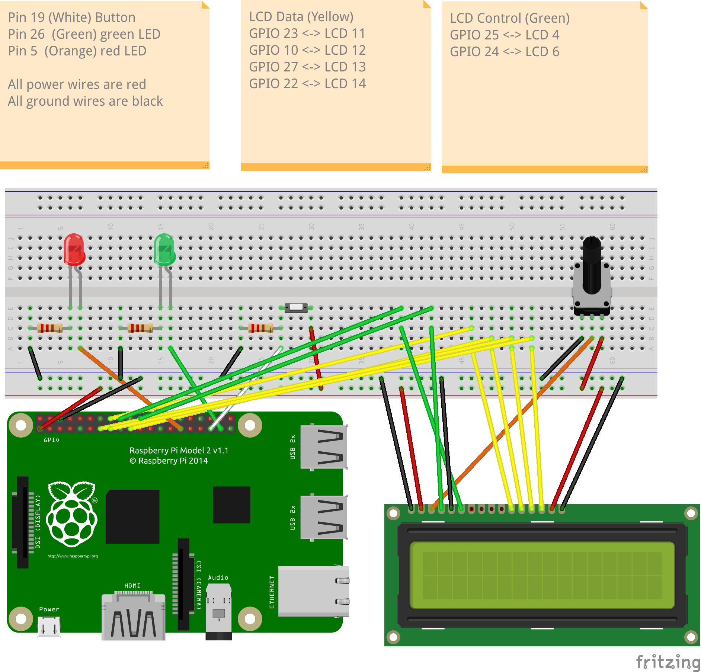

# f28hs-2025-26-cwk2-sys

Coursework 2 in F28HS "Hardware-Software Interface" on Systems Programming in C and ARM Assembler

The [CW specification is here](https://www.macs.hw.ac.uk/~hwloidl/Courses/F28HS/F28HS_CW2_2026.pdf)

This is a **pair coursework**.

Links:
- You can use any machine with an installation of the `gcc` C compiler for running the C code of the search logic
- Template for the C program: [cw2.c](cw2.c)
- Template for the ARM Assembler program: [hamming.s](hamming.s)

## Contents

This folder contains the several template files for CW2. You will need to **modify and complete** the following files:
- `cw2.c`         ... the main C program for the CW implementation
- `hamming.s`     ... the Hamming function, to be implemented in ARM Assembler
- `lcd-binary.c`  ... the low-level code for hardware interaction with LED, button, and LCD;
                      this should be implemented in inline Assembler; 

You should use the following C files (and the corresponding header files) as is:
- `lcd-fcts.c`    ... the software stack for using the LCD display
- `cw2-aux.c`     ... several auxiliary functions used in `cw2.c`

Note that the default settings for constants such as sequence length etc and wiring can be found in the header file:
- `cw2-config.h`  ... constants and wiring info

## Gitlab usage

**Fork** and **Clone** this gitlab repo to get started on the coursework.

Complete the functions in `cw2.c` and in `lcd-binary.c`. Initially, you can implement these as C
functions. However, for the final implementation, the low-level functions for controlling LED, button, and
LCD display should be implemented in inline Assembler (in `lcd-binary.c`). Note that the **Hamming function**,
for calculating the Hamming distance (see CW spec) also needs to be implemented in ARM Assembler.
The file `hamming.s` contains a template for this Assembler code.

**Push** to the repo and ask questions in the comments box to get help.

## Building and running the application

You can build the main C program (in `cw2.c`) by typing
> make all

and run the CW implementation like this
> sudo ./cw2 

a typical test configuration (for seqlen 3 and 3 digits, exhaustive serach, secret sequence 123) is run like this:
> sudo ./cw2 -d -e -n 3 -m 3 -s 123

For the Assembler part, you need to edit the `hamming.s` file, compile and test this version on the Raspberry Pi.

After having tested the components separately, integrate both so that the C program (in `cw2.c`)
calls the ARM Assembler code (in `hamming.s`) for the matching function.
For controlling the external devices of LED, LCD and button use inline Assembler code, as discussed in
the matching lecture in the course.

The final version of the code should be pushed to this repo, and also submitted through Canvas, together with the report and video.

The general format for the command line is as follows (see CW spec; this is supported by the template code in `cw2.c` for processing command line options):
```
 ./cw2 [-d] [-v] [-e] [-S <delay>] [-n <seqlen>] [-m <maxval>]
       [-u] [-s <secret sequence>] [-r <reference sequence>]
```

## Wiring

A **green LED**, as output device, should be connected to the RPi2 using **GPIO pin 26.**

A **red LED**, as output device, should be connected to the RPi2 using **GPIO pin 5.**

A **Button**, as input device, should be connected to the RPi2 using **GPIO pin 19.**

An **LCD display**, with a potentiometer to control contrast, should be wired to the
Raspberry by as shown in the Fritzing diagram below.

You will need resistors to control the current to the LED and from the Button. You
will also need a potentiometer to control the contrast of the LCD display.

The Fritzing diagram below visualises this wiring. 


